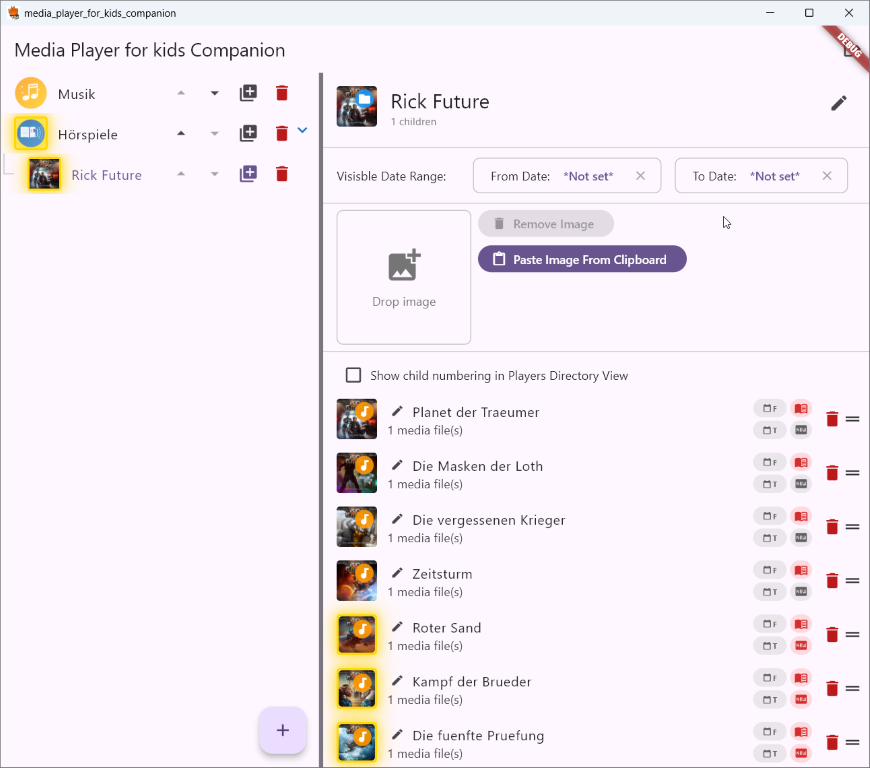

# Media Player for Kids

The "Media Player for Kids" is a media player app especially made for children. The operation is build on visual elements only, so children can use the app easily.

The content is completly parental controlled by a companion app. The architecture is like that, whereby the hosting of an own instance of CouchDb is mandatory:

# Screenshots of Companion and Player App

|  |  |
|-------|------|

# Use the package
## Einmalig Melos installieren
dart pub global activate melos

## Alle Packages bootstrappen (verlinkt lokale Dependencies)
melos bootstrap

## Alle Packages analysieren
melos analyze

## Alle Tests laufen lassen
melos test
