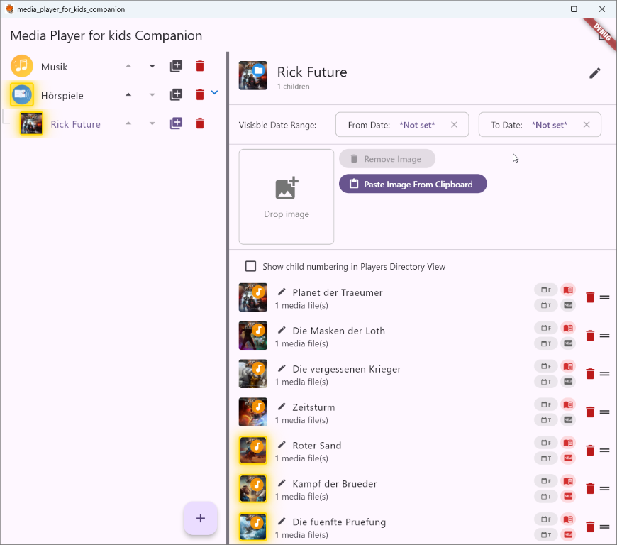
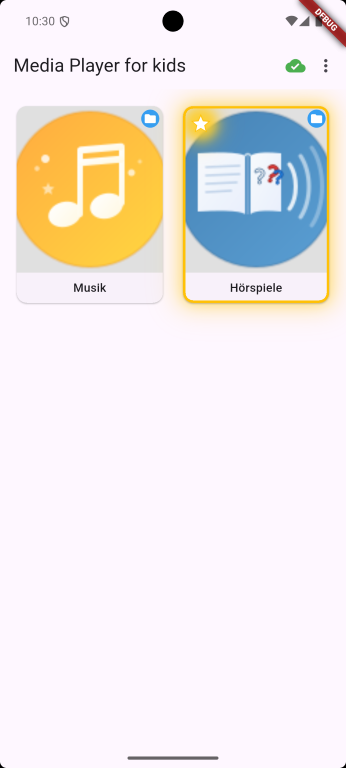

# Media Player for Kids

A media player built for children who can't read yet — and the parents who want to stay in control of what, when, and how much they listen.

The player is **fully visual**: cover-image tiles, no menus to read, no settings a curious finger can wreck. Everything a parent needs to manage — the catalog, the listening rules, the statistics — lives in a separate **companion app** on the desktop. The two apps sync through your own self-hosted CouchDB, so the whole system works offline and your kids' listening data never leaves your network.



## Screenshots

| Companion (desktop) | Player (Android) |
|---|---|
|  |  |

## Highlights

- **Child-friendly player.** Big cover tiles, no text required, audiobook resume positions, repeat and shuffle per item.
- **Parental controls that actually compose.** A small DSL of "hearing rules" (Hörregeln) lets you mix and match:
  - Maximum plays or minutes per day / week / month / rolling window
  - Only allowed during a time of day (e.g. 16:00–18:00)
  - Only allowed on certain weekdays, or within a date range
  - Folder-level shared budgets across a whole album or series
  - Composable with AND / OR / NOT for arbitrary policies
  - A **template picker** for the common cases — no DSL knowledge required
- **Global constraint on top of per-item rules.** A blanket "max 60 min / day across everything" stacks most-restrictively with per-item limits.
- **Listening statistics.** The companion shows what each kid has been listening to, by device and by kid name.
- **Grace period and visual hints.** When a kid is close to their limit, items they can no longer finish before the cutoff are marked with a small timer icon; fully blocked items get a lock. No text, kid-readable.
- **Audio import with loudness normalization.** Drag and drop files; the companion measures LUFS at import time so playback volume stays even across your library.
- **Visibility windows.** Hide a Christmas album from January through November, surface an Easter story for two weeks — purely via dates.
- **Per-device Bluetooth volume offsets.** Cap headphone output so it can never get too loud, regardless of the system volume.
- **Offline-first.** Both apps fully work without network; CouchDB replication reconciles when they meet again.
- **Cross-platform companion.** Windows, macOS, and Linux desktop. Player runs on Android.

## Repository layout

- `packages/player/` — the child-facing Android app
- `packages/companion/` — the parent-facing desktop app
- `packages/shared/` — common data models, the constraint DSL, and the constraint evaluator

Each package has its own `CLAUDE.md` / `README.md` with package-specific details. The root [CLAUDE.md](CLAUDE.md) documents the cross-package contracts (constraint semantics, play log model, device identity).

## Building from source

This is a Flutter / Dart monorepo managed with [Melos](https://melos.invertase.dev/).

```sh
# Install Melos once
dart pub global activate melos

# Bootstrap all packages (links local dependencies)
melos bootstrap

# Static analysis across all packages
melos analyze

# Run all tests
melos test
```

A self-hosted CouchDB instance is required for the two apps to sync; see the per-package READMEs for setup details.
