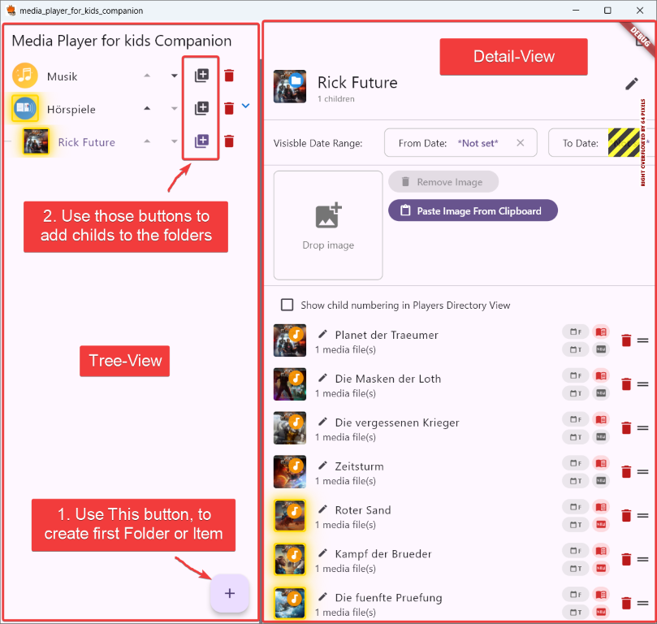
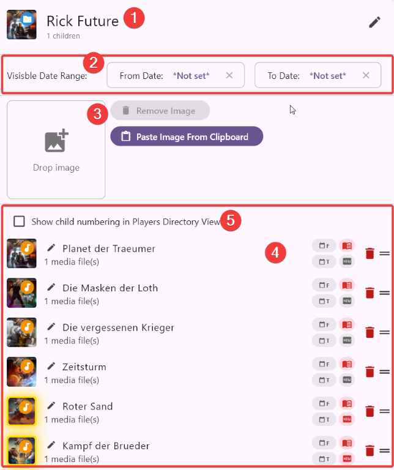
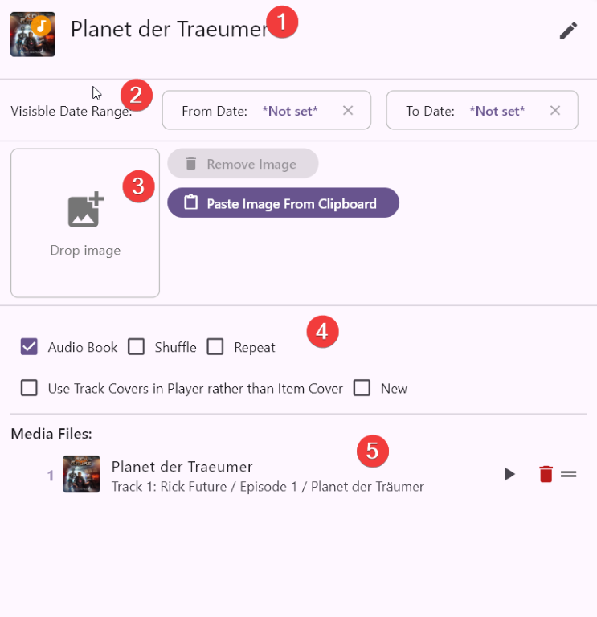
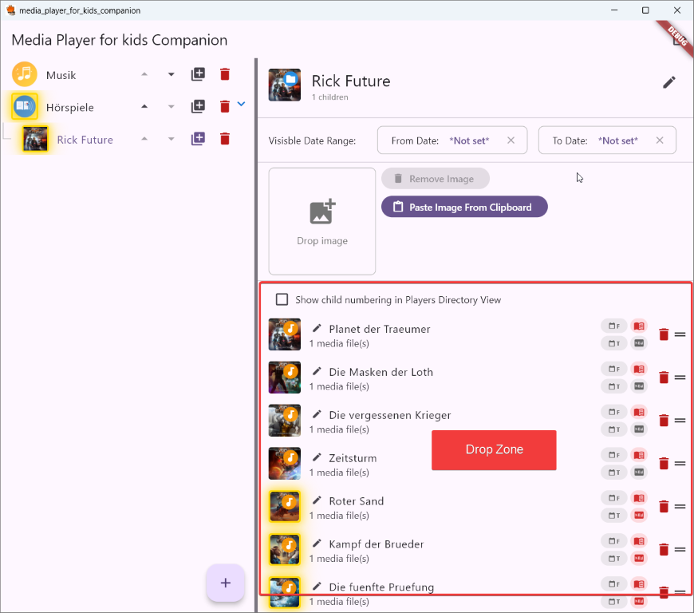
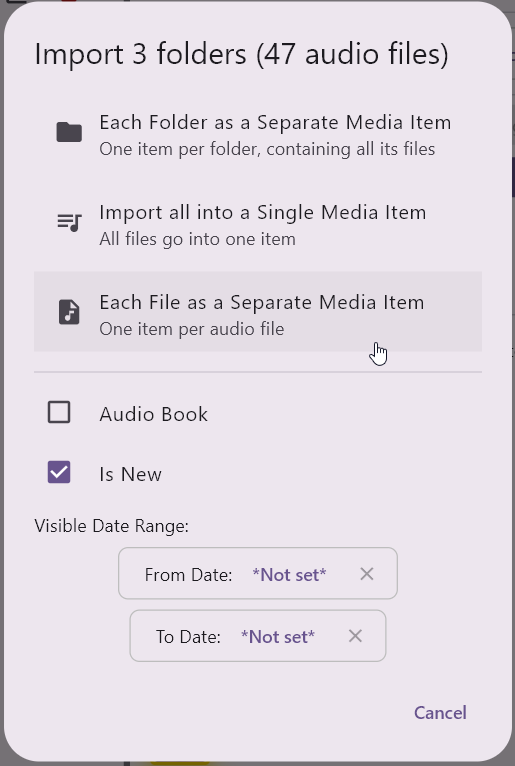

# media_player_for_kids_companion

The companion app for the media_player_for_kids. You can use it to set up the contents for your childs client app.

## Features
- when importing audio files their loudness will be scanned. Those results will be used by player app to normalize playback volume
- when importing audio files, meta data and covers are imported for later use

## Data Structure
This image shows the data structure used in this application:

There are folders and item. The folders can contain more folders and items and the items contain one or more audio files and can be played back.

## Main View
After logging in to your CouchDb-Server, you will get the following view:

At First use the Floating Action Button "+" to add some items to root, I personally add "Music" and "Audio Books". Then use the Buttons at the tree view items to add children to the folders.

Note, that the Tree View only shows folders. If you want to see the contained items, you need to click on a folder in the tree view!

## Detail View for folders

1. Title of the Folder. Can be changed by using the edit button
2. Filter for restricting availability for the folder to some days. I use that function to upload some content that gets not available to my child immediately, but day for day new content.
3. The image which is used in the player app for this folder. If no image is provided, the app tries to find a cover image in the folders childs automatically and takes the first match.
4. List View with children of the folder. Per entry you see the name of the Item and can edit it. The buttons at the right can be used for the following functions:
   - date from and to
   - Audio-Book Mode (Play Position will be saved and playback can later continue at the last position)
   - set is-new flag (Item is marked as new content as long as it has not been played back. It gets a golden glow in view)

## Detail View for Items

1. Title of the item, can be edited by using the edit button
2. Filter for restricting availability for the folder to some days. I use that function to upload some content that gets not available to my child immediately, but day for day new content.
3. The image which is used in the player app for this folder. If no image is provided, the app tries to find a cover image in the folders childs automatically and takes the first match.
4. Flags for item:
   - Audio Book enables storing of the last play position so next playback continues there
   - Shuffle enables shuffle play, useful for music items
   - Repeat enables "repeat all". May be useful for music
   - "Use Track Cover rather than item Cover" make the player view show the individual covers of the audio files instead of the items cover image. Useful maybe for music
   - New marks the Item as new and it will be marked with a golden glow in the app as well in this companion, so the child finds new content fast. The new flag automatically is removed when the player app starts playing.
5. List view with the included audio files. Use as drop zone for more files. Can be reordered. Use Play button for preview and delete button to remove. 

## Importing new Audio Files

The drop zone either in a folder or an item can be used to add more audio files.

On Folders you can drop:

| Import type | ... will be imported as |
|-------------|-------------------------|
| Single audio file | New Media Item |
| Multiple audio files | can select if all files in one Media Item (if the files belong to the same book or album) or each file in its own Media item | 
| Multiple folders | can select if all files in one Media Item (if the files belong to the same book or album) or each file in its own Media item  or if each folder shall become an own media item |

On Items you can drop one or multiple files, they will just be added to that item.

Before selecting import strategy, set additinal parameters as "Audio Book" or "Is New":

