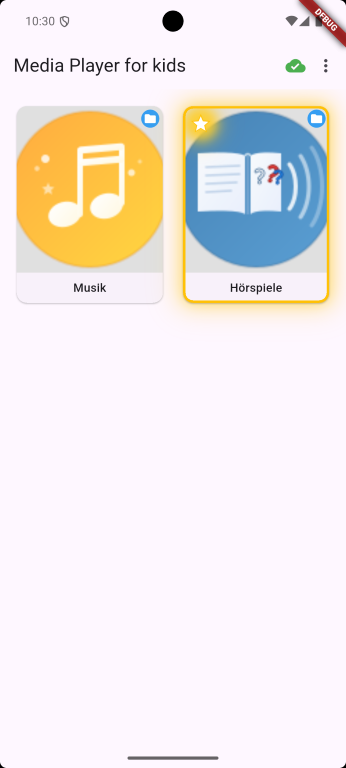
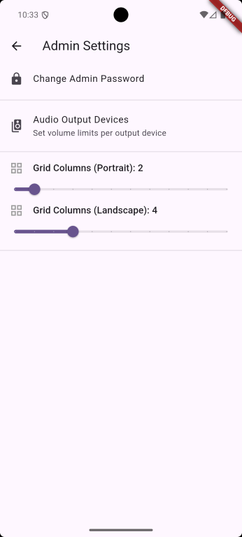
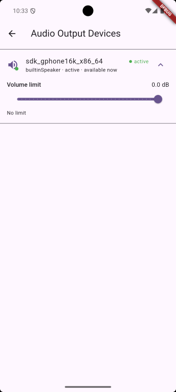

# Media Player for Kids

The usage should be quite self explaining. Use the Three-Dots button in the App Bar to enter Admin menu by entering the code which had been set at first app start.

## Admin Dialog

Use the admin dialog to change admin password and configure the grid layout of the main application view.

## Bluetooth configuration

Use the bluetooth dialog to configure volume offsets for the used playback devices. I for example have reduced the volume for headphones, so it won't get too loud for my boy.

The preview only shows internal speakers, but if you have connected bluetooth devices, they will also be visible there.

